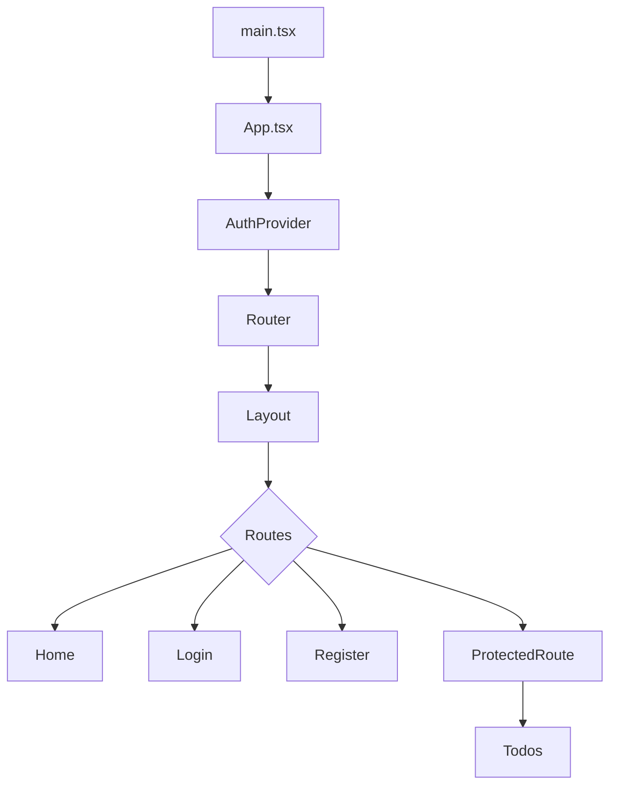
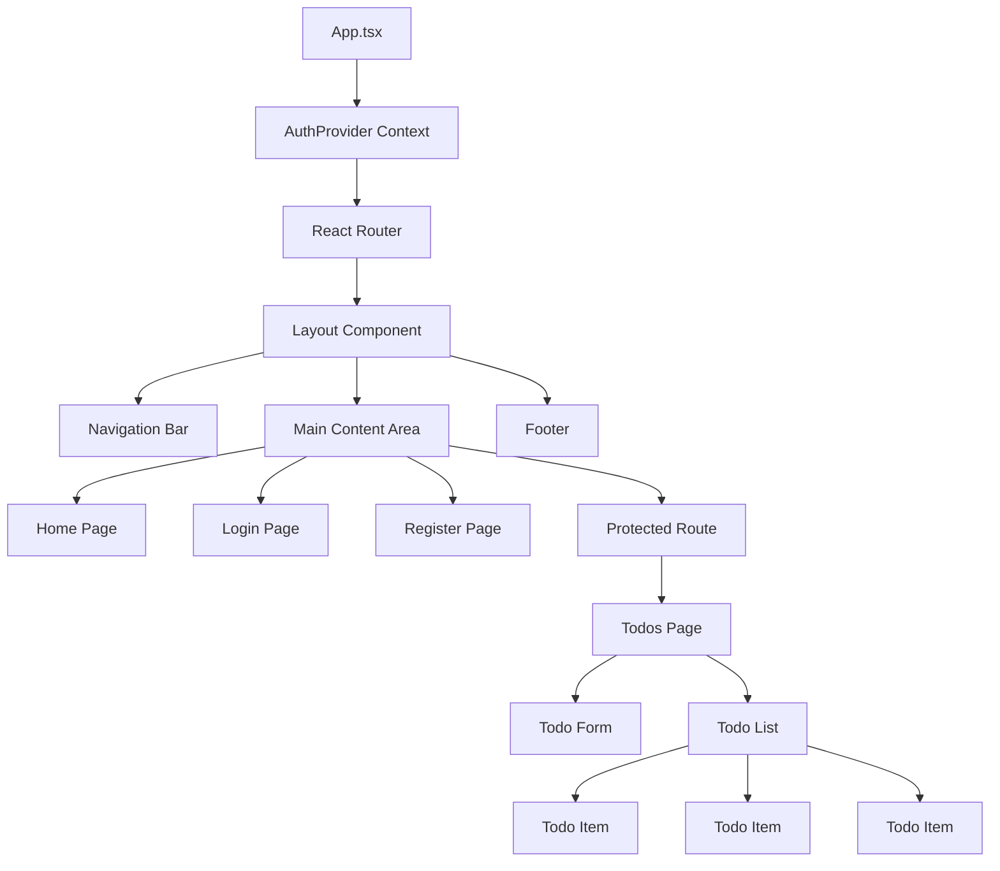
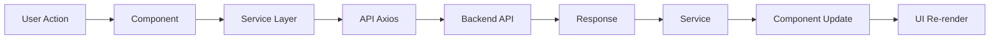
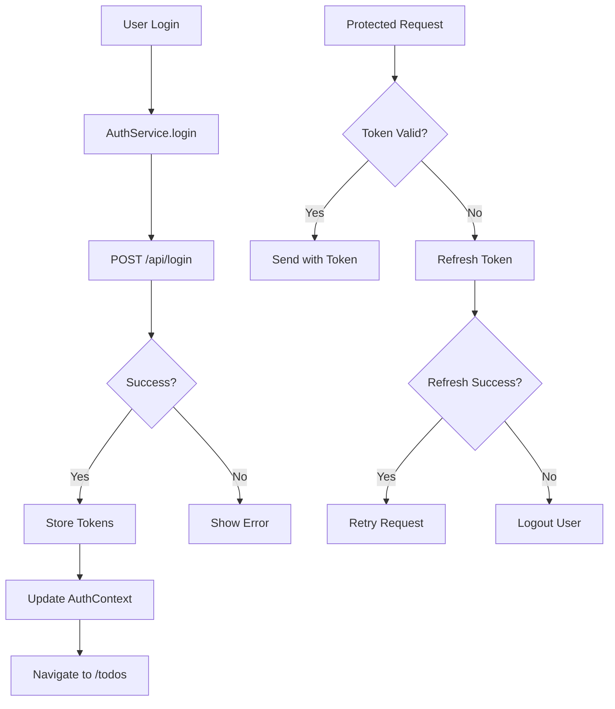

# Frontend Architecture

## Application Flow Diagram



## Component Hierarchy



## Data Flow



## Authentication Flow



## Folder Structure & Responsibilities

### `/components` - Reusable UI Components
- **Layout.tsx**: App shell with navigation and footer
- **ProtectedRoute.tsx**: Authentication guard for routes
- **TodoForm.tsx**: Form for creating new todos
- **TodoItem.tsx**: Display and edit individual todos

### `/contexts` - Global State Management
- **AuthContext.tsx**: User authentication state and methods

### `/hooks` - Custom React Hooks
- **useAuth.ts**: Access authentication context

### `/pages` - Route Components
- **Home.tsx**: Landing page with features
- **Login.tsx**: User login
- **Register.tsx**: User registration
- **Todos.tsx**: Main todo management interface

### `/services` - API Communication Layer
- **api.ts**: Axios instance with interceptors
- **authService.ts**: Authentication API calls
- **todoService.ts**: Todo CRUD operations

### `/types` - TypeScript Definitions
- **index.ts**: All application types

## State Management Strategy

### Local State (useState)
- Form inputs
- UI toggles (modals, dropdowns)
- Component-specific data

### Context State (AuthContext)
- User authentication
- Current user info
- Auth methods (login, logout, register)

### Server State (React Query - Future Enhancement)
- Todo list
- User data
- API cache

## API Service Pattern

```typescript
// Service Layer
export const todoService = {
  getTodos: () => api.get('/todos'),
  createTodo: (data) => api.post('/todos', data),
  updateTodo: (data) => api.put('/todos', data),
  deleteTodo: (id) => api.delete('/todos', { data: { id } })
}

// Usage in Components
const todos = await todoService.getTodos();
```

## Type Safety Flow

```
Types Definition (types/index.ts)
    ↓
Service Functions (services/*.ts)
    ↓
Component Props (components/*.tsx)
    ↓
State Management (useState, Context)
    ↓
UI Rendering
```

## Routing Structure

```
/                    → Home (Public)
/login               → Login (Public)
/register            → Register (Public)
/todos               → Todos (Protected - requires auth)
/*                   → Redirect to Home
```

## Error Handling Strategy

### API Errors
1. Interceptor catches error
2. Check if 401 (unauthorized)
3. Attempt token refresh
4. Retry original request or logout

### Component Errors
1. Try-catch in async functions
2. Set error state
3. Display error message to user
4. Provide retry mechanism

### Form Validation
1. Client-side validation
2. Show inline errors
3. Prevent submission if invalid
4. Server-side validation backup

## Performance Optimizations

### Current
- Code splitting by route
- Lazy loading (future)
- Optimized re-renders
- Memoization where needed

### Future Enhancements
- React.lazy() for routes
- Suspense boundaries
- Virtual scrolling for long lists
- Image optimization
- Service workers (PWA)

## Security Measures

1. **Token Management**
   - Stored in localStorage
   - Auto-refresh mechanism
   - Cleared on logout

2. **Protected Routes**
   - Authentication check before render
   - Redirect to login if unauthorized

3. **XSS Prevention**
   - React's built-in escaping
   - No dangerouslySetInnerHTML

4. **CSRF Protection**
   - JWT tokens (stateless)
   - No cookies used

## Development Workflow

```
1. Create/Update Types (types/index.ts)
2. Create Service Functions (services/*.ts)
3. Build Components (components/*.tsx)
4. Create Pages (pages/*.tsx)
5. Add Routes (App.tsx)
6. Test & Debug
7. Build & Deploy
```

## Testing Strategy (Future)

### Unit Tests
- Service functions
- Utility functions
- Hooks

### Integration Tests
- Component with services
- User flows

### E2E Tests
- Login flow
- Todo CRUD operations
- Navigation

## Build & Deployment

```bash
# Development
npm run dev          # Start dev server with HMR

# Production
npm run build        # Build optimized bundle
npm run preview      # Preview production build

# Quality
npm run lint         # Check code quality
```

## Key Design Decisions

1. **TypeScript First**: Full type safety for better DX and fewer bugs
2. **Service Layer**: Separate API logic from components
3. **Context for Auth**: Global auth state without prop drilling
4. **Functional Components**: Modern React with hooks
5. **Axios Interceptors**: Automatic token refresh
6. **Route Protection**: Centralized auth checking
7. **Inline Editing**: Better UX for todo updates
8. **Optimistic Updates**: Immediate UI feedback

## Dependencies

### Production
- react 19.1.1
- react-dom 19.1.1
- react-router-dom ^7.x
- axios ^1.x

### Development
- typescript 5.9
- vite 7.1
- eslint 9.x
- @vitejs/plugin-react 5.x

This architecture provides a solid foundation for a scalable, maintainable React application! 🚀
